# Project X

This is the final course project. Build a simple e-commerce application to support Wallymart's break in to the virtual space.

# Design overview

This project utilizes the model–view–controller (MVC) software design pattern.

## Design components

### Model

There are 3 database tables that we want to model our data over. Each of these tables are represented by a **record item** class to represent individual rows in the table, and a **database** class to support various database operations on the table. All data in the models are read from and written to disk as serialized Java objects. If files on disk does not exist or if data is invalid (serialize version not the same) the code will automatically start a fresh model.


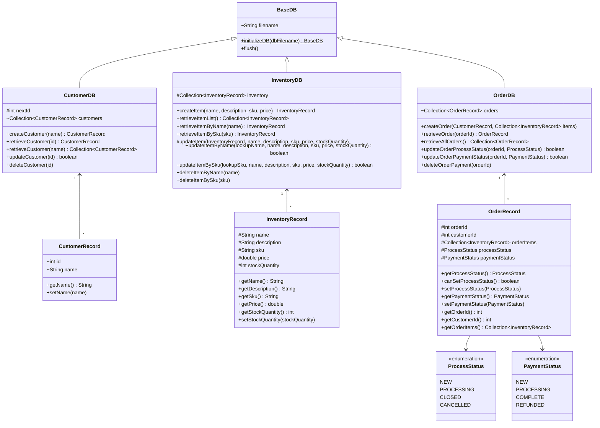

#### Inventory Model (`InventoryDB` & `InventoryRecord`)

Keeps track of the available inventory the store has. Each record contains the following information:
* Item name
* Item description
* Item SKU (only visible internally for employees)
* Unit price
* Available stock quantity

##### Features

* Standard *create, retrieve, update, delete* operations are available.
* Record retrieval supports *fast* lookups by item name **or** by item SKU.
* Updates support updating any attributes on a given record.

#### Customer Model (`CustomerDB` & `CustomerRecord`)

Records the customer information. For the scope of this project, only the name of the customer is recorded in this model. Each record contains the following information:
* id (autogenerated by code, only used internally in the code)
* name

##### Features

* Standard *create, retrieve, update, delete* operations are available.
* Record retrieval supports lookups by id **or** name. Lookups by id are preferred (faster), by name is still possible (slower).

#### Order Model (`OrderDB` &` OrderRecord`)

Records the orders made in the system. Each record contains the following information:
* orderId (autogenerated by code)
* customerId (refers to a customer record id)
* processStatus (enum of status values)
* paymentStatus (enum of payment values)
* list of ordered items (sorted by item name)
 
##### Features

* Standard *create, retrieve, update, delete* operations are available.
* Updates are limited to the two status updates. All other attributes are immutable.

### View

The view is implemented using the Java Swing toolkit. There is also a text version of the UI, which can easily replace the graphical version by changing the instantiation of the initial screen class in the controller. For the scope of this document, only the graphical version is reviewed.
Since the Swing launches graphic elements on a separate thread, the `main` thread *waits* after launching each window. Once the UI window is complete (user finishes interacting in the window, e.g. clicks a button to advance to next window) the `main` thread *wakes* up to execute the next action (e.g. start the next window).


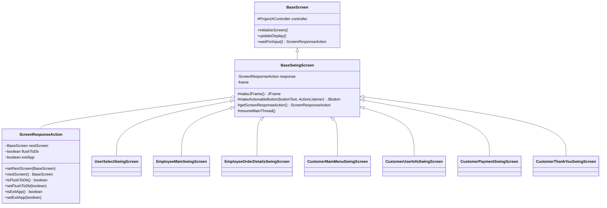

#### User Experience Flow


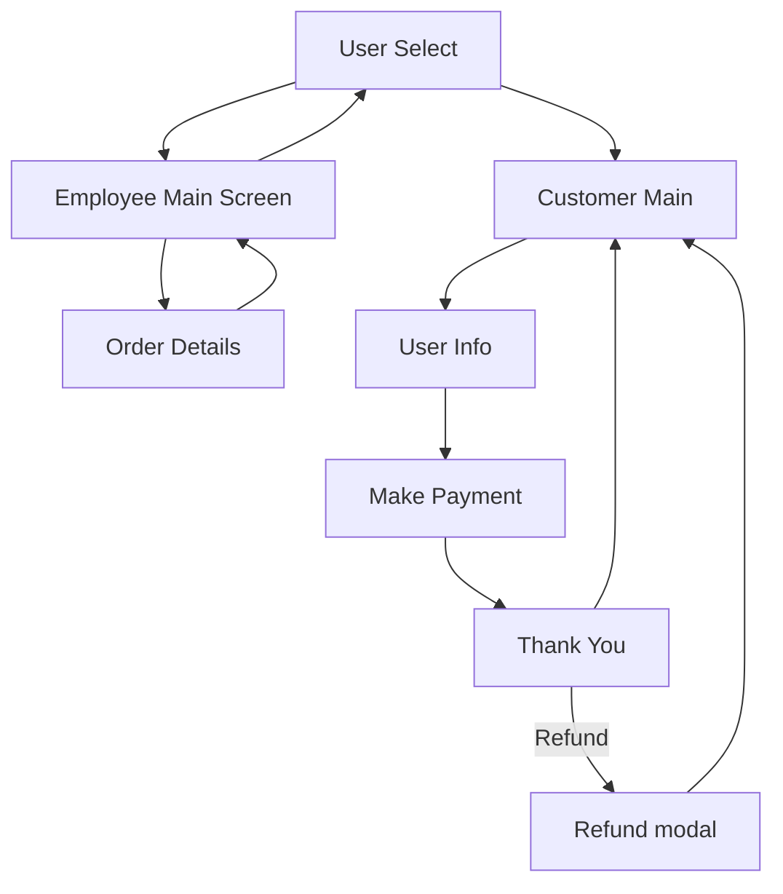

#### User Select View (`UserSelectSwingScreen`)

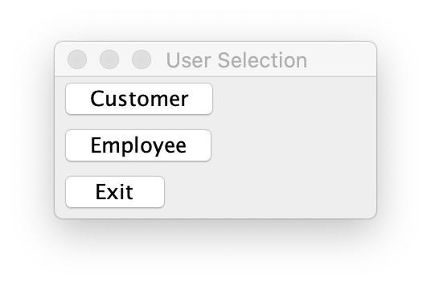

Initial screen when the application starts. This screen is meant for the user to select their role, either *employee* or *customer*.
<br clear="right"/>

#### Employee Main View (`EmployeeMainSwingScreen`)

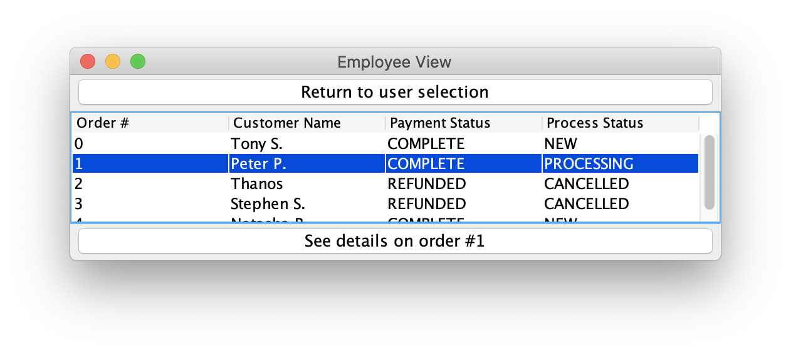

Displays a table of `orders` made in the system. Note that the table will be empty if no customers made any orders. Table data is immutable in this view, but the user can select individual rows and click on the `See details` button to operate on the order record.
<br clear="right"/>

#### Employee Order Details View (`EmployeeOrderDetailsSwingScreen`)

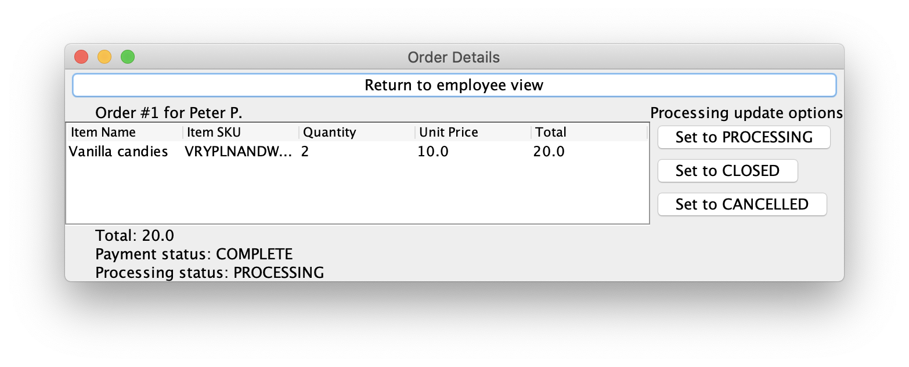

Displays the order details selected from the previous screen. Details include a list of the items ordered and the total cost of the order. If the order is in a processing status where it can be updated, the employee can change the processing status of the order. Only processing status `NEW` and `PROCESSING` can be updated, all other status disable the update buttons.
<br clear="right"/>

#### Customer Main Menu View (`CustomerMainMenuSwingScreen`)

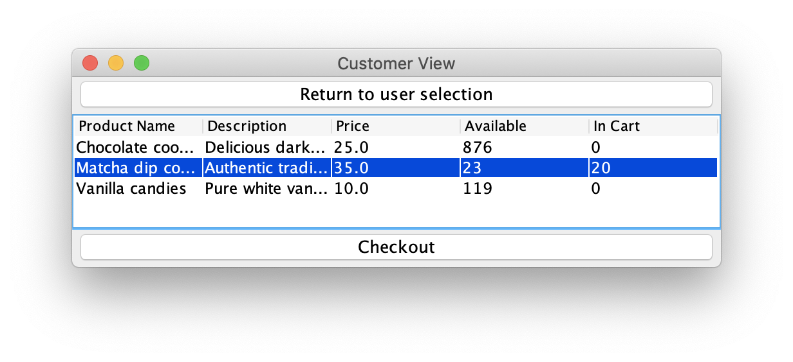

Main screen presented to the customer. Includes a list of all inventory items, description, unit price and available stock. Customer can select the `In Cart` column for each item and change it to a number to *purchase* that item. The `Checkout` button will be clickable when at least one item is added to the cart, and the values are valid (non-negative, valid number, <= available stock).
<br clear="right"/>

#### Customer User Info View (`CustomerUserInfoSwingScreen`)

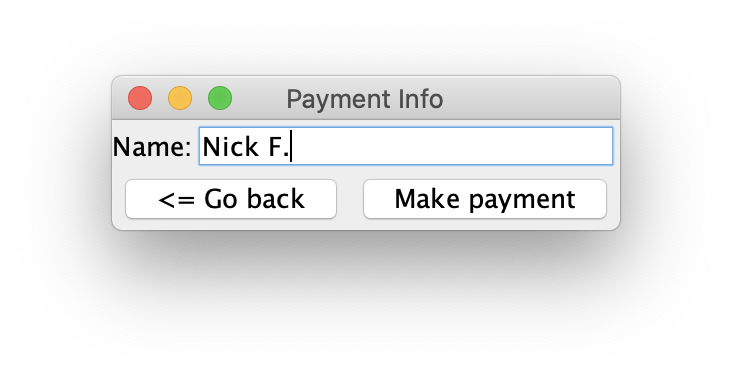

Customer can enter user info in this screen. For the scope of this project, only the customer's name is required. The `Make Payment` button is only enabled if there is *anything* typed into the name text field (i.e. non-empty).
<br clear="right"/>

#### Customer Payment View (`CustomerPaymentSwingScreen`)

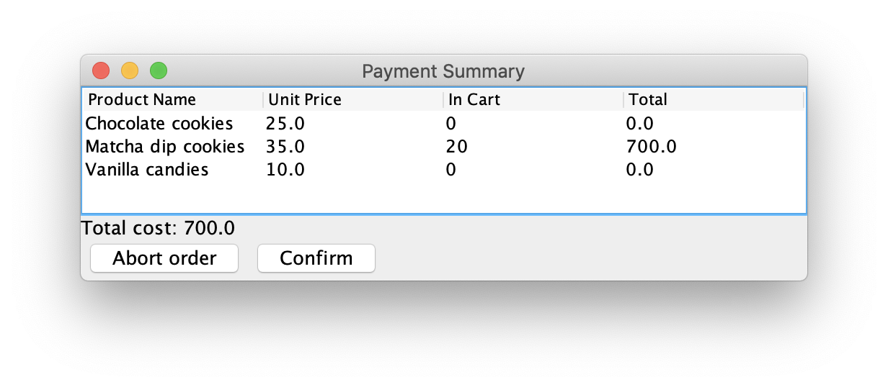

Customer order summary and payment confirmation screen. For the scope of this project, the `Payment` button is always enabled and pressing it assumes successful payment.
<br clear="right"/>

#### Customer Thank You View (`CustomerThankYouSwingScreen`)

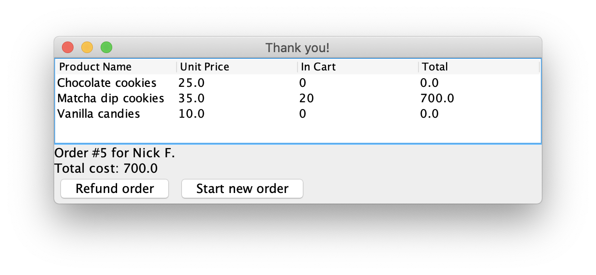

Final `Thank You` screen for the customer to see. Contains the order summary **and** the order number generated upon a successful order. Customer is presented an option at this moment to *refund* the order by pressing the `Refund` button. Otherwise, customer can press the `Start new order` button to return back to the main customer screen.
<br clear="right"/>

### Other UI Notes

#### Refund notice (Modal dialog)

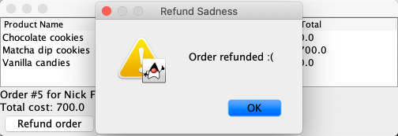

Uses the built in modal dialog to inform that the order was refunded. Inventory and order databases updated to reflect the refunded item quantities and order payment status.
<br clear="right"/>

#### ScreenResponseAction (Supporting class)

Upon exiting each window, a `ScreenResponseAction` object gets created and populated with instructions for the controller to execute. Instructions may include:
* Launch a new view object (advance to another UI window)
* Flush DB data to disk
* Exit the application

### Controller

#### ProjectXController

The main loop and flow control logic is done in this class. Model and UI instantiation are all done within this controller class. Developer can easily switch UI implementation by switching the first screen assignment during initialization.
For demo purposes, if there is no data present, the controller will execute `populateDemoData` to populate some data.


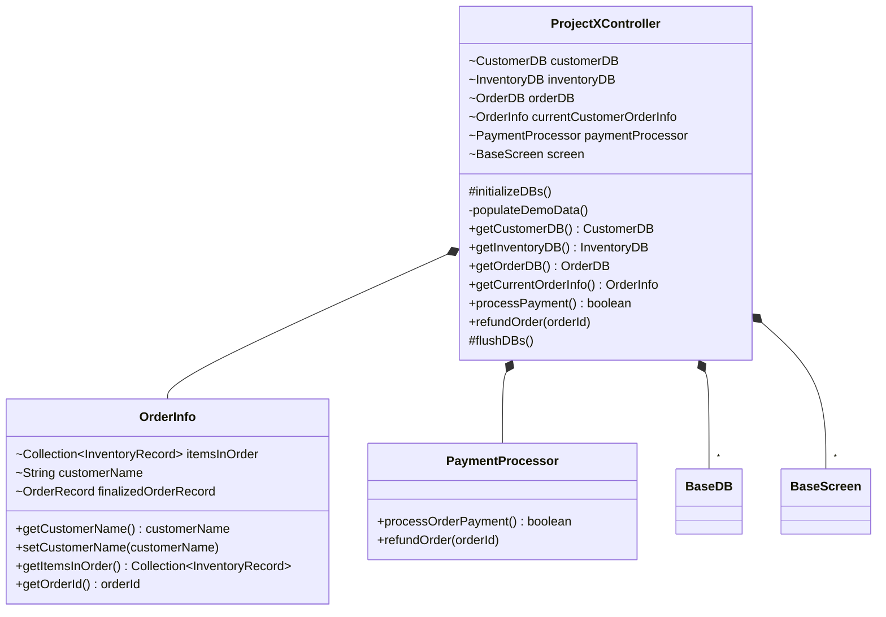

#### PaymentProcessor

This is a mock controller class to represent communications with a 3rd party payment library. For the scope of this project, all payments transactions are assumed to be successful. This class will update the internal `OrderDB` to reflect all payment transactions.

#### OrderInfo

Contains the *current session's* order info before committing the data to the DB classes. A typical customer session contains:
* Customer Info (name)
* List of items ordered
* Order Id once the order is committed

## Sequence diagram

### Employee flow


```mermaid
sequenceDiagram
Employee ->> Main Screen: Select employee mode
activate Main Screen
Main Screen ->> OrderDB: Fetch orders
activate OrderDB
OrderDB -->> Main Screen: Return list of orders
deactivate OrderDB
Main Screen ->> Details Screen: Display order details
deactivate Main Screen
activate Details Screen
Details Screen ->> OrderDB: Fetch order details
activate OrderDB
OrderDB -->> Details Screen: Return order details
deactivate OrderDB
Employee ->> Details Screen: Change process status
Details Screen ->> OrderDB: Update process status for given order
Details Screen -->> Main Screen: Return to main screen
deactivate Details Screen
```

### Customer flow


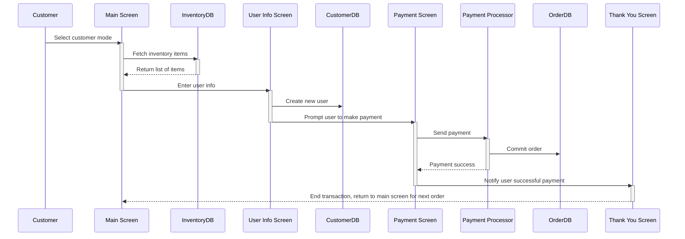
## Conclusion
The application works as intended. I found it challenging to figure out what to implement, what not to implement, and how to most effectively structure the app in a model, view, controller format. For instance, additional features that could be implemented in the future are a full integration with a third party payment system, interface with an actual database, and additional features like product reviews. I ended up resolving the issues by using UML to organize my thoughts. The project was great to put into practice a lot of the subjects we learned in this class including GUI, serialization, and multi-threading.

## References
I used the Java Swing library to make the GUI. https://docs.oracle.com/javase/7/docs/api/javax/swing/package-summary.html

## Miscellaneous Notes
* This document was edited using [StackEdit.io](https://stackedit.io/).
* You can render UML diagrams using [Mermaid](https://mermaidjs.github.io/).
